# optimizing a matmul end-to-end on an M4 ARM processor
*Preface: everything in this page is self-taught. Take what I say with a grain of salt, things could be wrong / misinformed, everything's a learning experience!*

## cpu backend
### naive initial matmul
Our starting point is a naive matrix multiplication algorithm:
```cpp
void matmul(TensorF32<2> a /* M x K */, TensorF32<2> b_trans /* N x K */,
            MutTensorF32<2> out /* M * N */)
{
    for (size_t i = 0; i < M; ++i)
    {
        const size_t out_column_offset = i * N;
        const size_t a_column_offset   = i * K;

        for (size_t j = 0; j < N; ++j)
        {
            const size_t out_idx = out_column_offset + j;

            float32_t acc = 0.f;
            for (size_t k = 0; k < K; ++k)
            {
                acc += a[a_column_offset + k] *
                       b_trans[j * K + k];
            }

            out[out_idx] = acc;
        }
    }
}
```
#### access pattern of the naive algorithm
Our memory hierarchy consists of registers -> L1 cache -> L2 cache -> L3 cache (shared) -> memory, and generally at each level access latency is an order of magnitude larger. Ideally, we want to maximise data re-use and minimize the number of cache misses so our average memory access latency is lower.

We already do this in one way by transposing $B$, meaning its data is accessed in row-major order and hence when a cache line is first fetched, subsequent elements are cache hits until we have a compulsory miss.

```
  matmul: out(M x N) = a(M x K) @ b_trans(N x K).T      roofline: 63 GFLOP/s / 34 GB/s
  case                   M     K     N    AI      f=1      f=4      f=8     f=12     f=16    best  %roof   cv%
  ------------------------------------------------------------------------------------------------------------
  decode gate_proj       1   896  4864   0.5     2.36     2.35     2.35     2.35     2.35     f=1    14%   1.6
  decode o_proj          1   896   896   0.5     2.34     2.33     2.34     2.33     2.34    f=16    14%   2.7
  decode qkv             1   896  1152   0.5     2.34     2.34     2.34     2.35     2.34    f=12    14%   2.4
  prefill gate_proj     50   896  4864  23.5     2.35     2.35     2.35     2.35     2.35    f=12     4%   0.1
  prefill o_proj        50   896   896  22.5     2.36     2.35     2.36     2.35     2.36     f=1     4%   0.1
  attn QK^T 1 head      50    64    50   9.0     5.92     5.97     5.97     5.93     5.93     f=4     9%  20.9
  attn PV 1 head        50    50    64   9.0     6.44     6.47     6.46     6.47     6.46     f=4    10%  23.5
  lm_head                1   896  4096   0.5     2.35     2.34     2.33     2.35     2.35     f=1    14%   0.8
  awkward K (=101)       8   101   512   3.7     5.05     5.06     5.04     5.04     5.07    f=16     8%  10.5
  square 256           256   256   256  42.7     3.39     3.39     3.39     3.41     3.41    f=16     5%   0.1

```

#### register tiling
We can make an improvement by looking at our memory hierarchy. When we perform a load into a register, ideally we maximise the amount of data reuse at that register. Currently, every FMAC requires two loads for a read, and then a single store at the end of our inner reduction. However, notice that when we load $A[i,k],$ we could have re-used this value for up till $N$ FMACs.

It seems like maybe when we load $A[i, k]$, we should load $B^T[j-1, k], B^T[j, k], B^T[j+1, k], \ldots$  or some combination that saturates our registers, compute our FMACs, and then write back to the appropriate locations?

Formalizing this idea, let us tile over the output with tile size $[T_M, T_N],$ and perform reductions along the inner dimension with size $T_K.$ Hence, every step of the inner reduction we load $(T_M + T_N) \cdot T_K$ values, and perform $T_M \cdot T_N \cdot T_K$ FMACs, resulting in a 
$$
\dfrac{1}{T_M} + \dfrac{1}{T_N}
$$
ratio, as long as $(T_M + T_N) \cdot T_K \leq R,$ where $R$ is the capacity that we can store in our frontend register file.

This also suggests we should push $T_K \to 1$ to achieve the maximum arithmetic intensity. *Note:* this inner step  essentially an outer product reduced over $k$.

However, this now means our access pattern over $A$ and $B$ is partially column major. If the entirety of our working set can fit in cache, this is not a problem. Otherwise, we can resolve this by first interleaving the memory layout of our tensors such that access is contiguous when we do our compute:

```
  matmul: out(M x N) = a(M x K) @ b_trans(N x K).T      roofline: 63 GFLOP/s / 34 GB/s
  case                   M     K     N    AI      1x1      1x4      2x2      4x4      4x8      8x4    best  %roof   cv%
  ---------------------------------------------------------------------------------------------------------------------
  decode gate_proj       1   896  4864   0.5     2.35     6.39     3.83     6.38     8.13     6.41     4x8    48%   8.2
  decode o_proj          1   896   896   0.5     2.34     6.41     3.80     6.41     8.03     6.39     4x8    48%   8.7
  decode qkv             1   896  1152   0.5     2.35     6.45     3.81     6.44     8.09     6.44     4x8    48%   1.2
  prefill gate_proj     50   896  4864  23.5     2.36     6.42     6.55    15.64    23.91    22.84     4x8    38%   2.3
  prefill o_proj        50   896   896  22.5     2.36     6.59     6.61    15.90    24.38    23.54     4x8    39%   1.5
  attn QK^T 1 head      50    64    50   9.0     5.95     6.99     7.07    13.57    16.00    16.03     8x4    25%  57.2
  attn PV 1 head        50    50    64   9.0     6.46     7.25     7.26    15.21    18.55    18.60     8x4    30%  63.4
  lm_head                1   896  4096   0.5     2.35     6.54     3.84     6.48     8.26     6.49     4x8    49%   6.1
  awkward K (=101)       8   101   512   3.7     5.04     7.65     7.72    17.40    23.01    24.42     8x4    39%  54.9
  square 256           256   256   256  42.7     3.39     7.05     7.07    17.53    25.35    26.13     8x4    41%   0.9
```

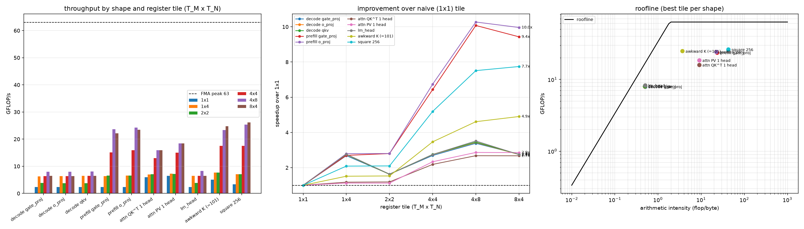
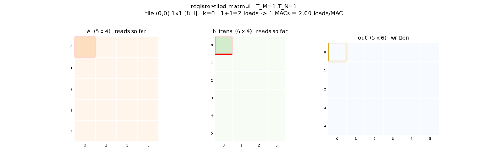
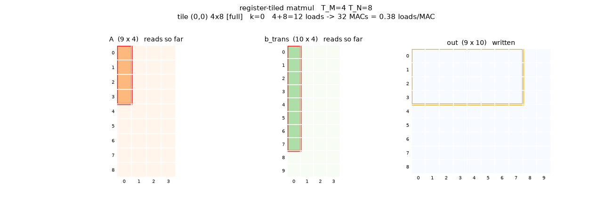

#### simd execution
We can use the vector registers (128 bits) in the M-series ALU to execute operations in SIMD. Here, we have to choose our SIMD dimension. Since we're storing matrices row-major, the simplest solution is SIMD across the k-dimension; it makes sense both cache-wise (keeping our working set small and localised), and avoids a interleaved load step.

With this, our inner iteration looks something like:
```cpp
    float32x4_t acc[TILE_M][TILE_N] = {};
    for (size_t k = 0; k + 4 <= K; k += 4)
    {
        float32x4_t a_col[TILE_M], b_row[TILE_N];

        for (size_t i = 0; i < tile_m_size; ++i)
        {
            a_col[i] = vld1q_f32(a.data() + (i0 + i) * K + k);
        }

        for (size_t j = 0; j < tile_n_size; ++j)
        {
            b_row[j] = vld1q_f32(b_trans.data() + (j0 + j) * K + k);
        }

        for (size_t i = 0; i < tile_m_size; ++i)
        {
            for (size_t j = 0; j < tile_n_size; ++j)
            {
                acc[i][j] = vfmaq_f32(acc[i][j], a_col[i], b_row[j]);
            }
        }
    }
    ...
    for (size_t i = 0; i < tile_m_size; ++i)
    {
        size_t const offs = (i0 + i) * N;

        for (size_t j = 0; j < tile_n_size; ++j)
        {
            out[offs + j0 + j] = vaddvq_f32(acc[i][j]);
        }
    }

```
yielding the following improvements: 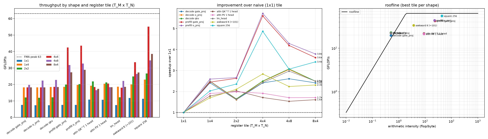.

Here's a comparsion of the access patterns:
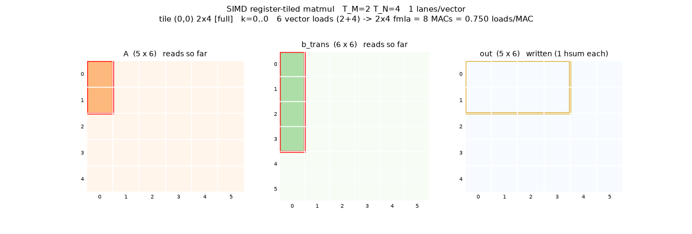
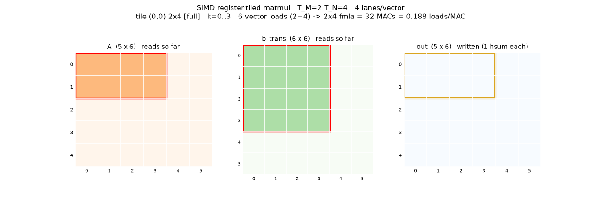

#### optimizing cache access
Fundamentally, the way we want to take advantage of our memory hierarchy is to take advantage of reuse. If we access $A[i, k]$ $N$ times, and it's evicted from the cache after every successive access, then we pay the DRAM access penalty $N$ times.

Let's look at the data reuse for both $A$ and $B.$:
- $A[i, k]$ is required $N$ times (in the computation of $O[i, \ldots]$)
- $B^T[j, k]$ is required $M$ times (in the computation of $O[\ldots, j]$)

Now, let's also analyze the number of bytes accessed between sequential reads of $A[i, k]$ in a naive matmul. For the sake of simplicity, we use the pseudocode:
```
for i:
    for j:
        for k:
            out[i, j] += a[i, k] * b_T[j, k]
```
After every $K$ iterations, $a[i, k]$ is re-used. However, $B^T[j, k]$ is re-used after every $NK$ iterations. It's clear that because $B$ has the faster moving indices, it's more likely to have $B^T[j, k]$ evicted from the cache by the time it's re-used.

The easy way to improve this access pattern is just by reducing this number. If we simply re-order the outer iterations, we move the problem to $A$

##### cache tiling
Instead, let's access $B^T[j, k]$ a little earlier by not iterating over the entirety of the dimension $N,$ but only a "tile" of it, say with size $T_N$
```
for j_tile in range(N / T_N):
    for i in range(M):
        for j in range(T_N):
            for k in range(K):
                out[i, j_tile * T_N + j] += a[i, k] * b_T[j_tile * T_N + j, k]
```
Let's look at access cadences for $A$ and $B$ now.

- $B^T[j_0, k_0]$ is accessed whenever $(j_\text{tile} \cdot T_n + j, k) = (j_0, k_0).$ Since the flattened iteration index is $$k + j \cdot (K) + i \cdot (T_N \cdot K) + j_\text{tile} \cdot (M \cdot T_N \cdot K),$$
we access $B^T[j, k]$ every $T_N \cdot K$ iterations. *Note*: $T_N = 1$ has the effect of essentially swapping the order of iteration.

- $A[i_0, k_0]$ is accessed whenever $(i, k) = (i_0, k_0),$ meaning both $j_\text{tile}$ and $j$ are free. Hence, $A[i_0, k_0]$ is accessed at iterations $$\underbrace{k_0 + i_0 \cdot (T_N \cdot K)}_\text{constant} + K \cdot j + (M \cdot T_N \cdot K) \cdot j_\text{tile},$$
i.e every $K$ iterations, in blocks spread apart by $M \cdot T_N \cdot K.$

We can visualize both cadences using a cool GIF generated by Claude!

1. $B^T[3, 2]$ untiled ($T_N = N$), then tiled ($T_N = 2$):

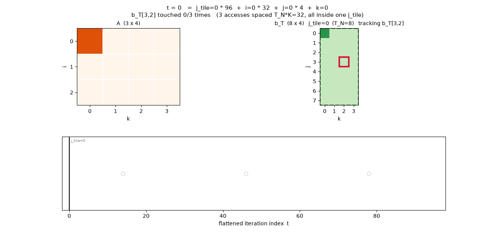
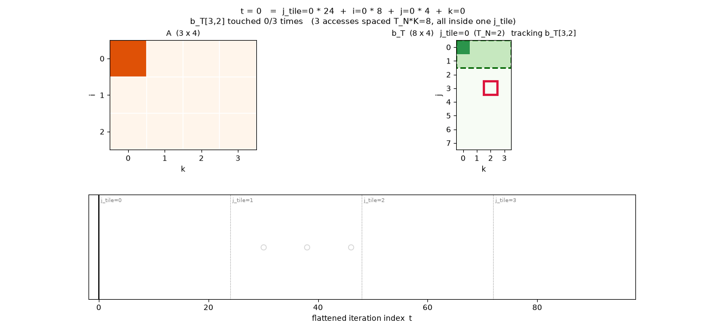

2. $A[2, 2]$ untiled then tiled

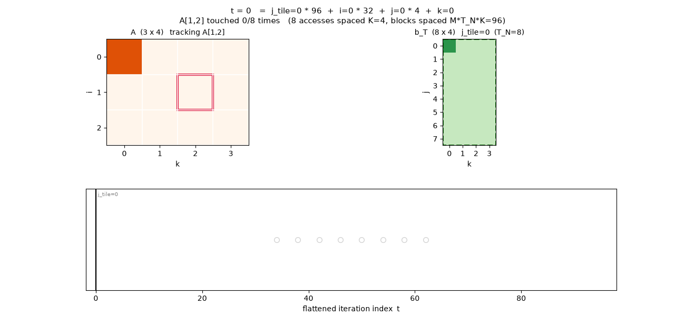
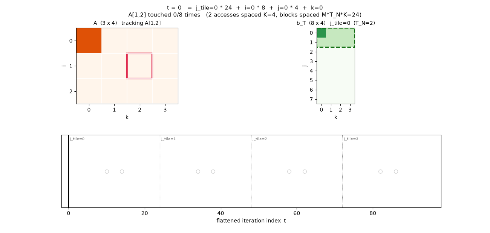


#### formalizing the tiling math
Is there a way to determine an optimal tiling strategy, or at least develop intuition for the trade-offs? Let's operate in a search space that looks something like the following:
```
for i_chunk in range(M // T_M):
    for j_chunk in range(N // T_N):
        for i in range(T_M):
            for j in range(T_N):
                for k in range(K):
                    out[i_chunk * T_M + i, j_chunk * T_N + j] += a[i_chunk * T_M + i, k] * b_t[j_chunk * T_N + j, k]
```
To analyse the access cadences, it's useful to convert everything to a flat index
$$
f = i_\text{chunk} \times (N T_M K) + j_\text{chunk} \times (T_M T_N K) + i \times (T_N K) + j \times K + k
$$

- $A[i_0, k_0]$ is accessed whenever $i + i_\text{chunk} \cdot T_M = i_0,$ and $k = k_0,$ fixing the $(i, i_\text{chunk}, k)$ when this occurs. I.e, accesses every $K$ iterations ($T_N$ times), which then repeats every $T_M T_N K$ iterations of this block.

- $B^{T}[j_0, k_0]$ is similarly accessed every $T_N K$ iterations ($T_M$ times), with a macro-period of $N T_M K.$

Hence, we want $T_N$ to be as large as possible (so we have more cache hits on $A$), while maintaining the cadence of accesses on $B$ to be short enough such that we get a cache hit on the next successive access.

Increasing $T_M$ reduces our ability to maintain the elements of $A$ in cache across chunks, while increasing the length of a streak of accesses on $B.$

For an extreme case:
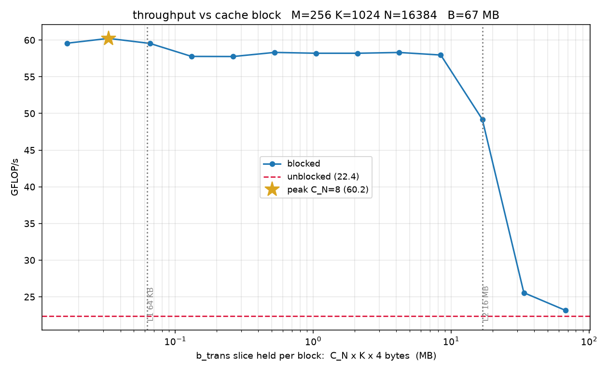

## metal
Now, let's try and take advantage of the M4 GPU, writing a `matmul` kernel in metal. At a high level, the metal compute model looks like
`
threads <- SIMD groups (execute in lockstep, like warps) <- threadgroups (share thread group memory,. 32 KB) <- grid (logical)
`

### register tiling
At a naive level, register tiling is easy to reason about. Each thread has its own set of registers, and we want to maintain accumulators backed by registers, not shared memory, so each thread should own some register tile chunk of the output matrix (reducing over the inner dimension):
```cpp
template <uint T_M, uint T_N>
kernel void matmul(device const float *A [[buffer(0)]],
                   device const float *B [[buffer(1)]],
                   device float       *C [[buffer(2)]],

                   constant TensorDesc &a_desc [[buffer(3)]],
                   constant TensorDesc &out_desc [[buffer(4)]],

                   uint2 tgid [[threadgroup_position_in_grid]],
                   uint2 tptg [[threads_per_threadgroup]],
                   uint2 lid [[thread_position_in_threadgroup]])
{
    uint const K = a_desc.shape[a_desc.rank - 1];
    uint const M = out_desc.shape[out_desc.rank - 2];
    uint const N = out_desc.shape[out_desc.rank - 1];

    // thread position in grid, then the corner of its register tile
    uint2 const gid = tgid * tptg + lid;

    uint const row = gid.y * T_M;
    uint const col = gid.x * T_N;
    uint       a_base[T_M], b_base[T_N];

    for (uint m = 0; m < T_M; ++m)
    {
        a_base[m] = min(row + m, M - 1) * K;
    }
    for (uint n = 0; n < T_N; ++n)
    {
        b_base[n] = min(col + n, N - 1) * K;
    }

    float acc[T_M][T_N] = {};
    for (uint k = 0; k < K; ++k)
    {
        float a[T_M], b[T_N];
        for (uint m = 0; m < T_M; ++m)
        {
            a[m] = A[a_base[m] + k];
        }
        for (uint n = 0; n < T_N; ++n)
        {
            b[n] = B[b_base[n] + k];
        }

        for (uint m = 0; m < T_M; ++m)
        {
            for (uint n = 0; n < T_N; ++n)
            {
                acc[m][n] = fma(a[m], b[n], acc[m][n]);
            }
        }
    }

    for (uint m = 0; m < T_M; ++m)
    {
        for (uint n = 0; n < T_N; ++n)
        {
            if (row + m < M && col + n < N)
            {
                C[(row + m) * N + col + n] = acc[m][n];
            }
        }
    }
}
```

### threadgroups
However, at this level we're optimizing for an implicit memory hierarchy that consists of 
```
registers <- device memory (SoC)
```

This ignores the fact that our thread groups have their own shared memory with a lower access latency. If we thrash this shared memory, we get lower performance.

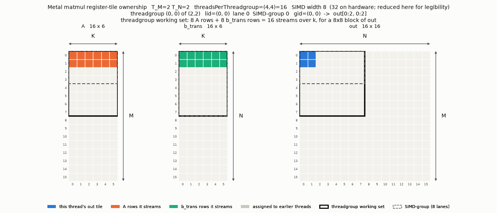

With only register tiling, there are no guarantees on the size of each thread group's working set. Threads (that execute in paralell) each own a 'tile' of the output. However, in this case our topology (computing thread coordinate based on threadgroup coordinate) guarantees some sort of thread group tiling, dependent on what we pass in for `tptg` and `tgpg`. Here, we can control the size of each tile by varying `tptg` (and appropriately decreasing `tgpg`).
