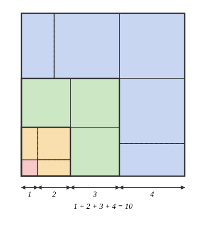
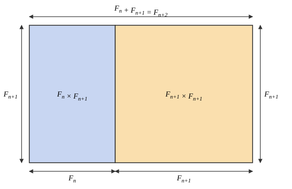

# math4802 - mathematical problem solving
*Worked solutions to problems from [MATH4802](https://math.gatech.edu/courses/math/4802). Problems are labelled by difficulty, i.e green circle (easiest), blue square, black diamond.*

## induction
### green circle, 1
> Show that $1^3 + 2^3 + \ldots + n^3 = (1 + 2 + \ldots + n)^2,$ algebraically and with a picture.

To telescope, we write $4k = (k+1)^2 - (k-1)^2,$ yielding
$$
\begin{align*}
\sum_{k = 1}^{n} k^3 &= \sum_{k = 1}^{n} k^2 \left(\dfrac{(k+1)^2 - (k-1)^2}{4}\right) \\
&= \frac{1}{4}\left(\sum_{k = 1}^{n} k^2(k+1)^2 - \sum_{k = 1}^{n}k^2(k-1)^2\right) \\
&= \frac{1}{4}\left(\sum_{k = 1}^{n} k^2(k+1)^2 - \sum_{k = 0}^{n - 1}(k + 1)^2k^2\right) \\
&= \dfrac{1}{4}\left(n^2(n+1)^2\right) \\
&= \left(\dfrac{n(n+1)}{2}\right)^2 \\
&= \left(\sum_{k = 1}^{n} k\right)^2,
\end{align*}
$$
using the well-known closed form of $1 + 2 + \ldots + n,$ and thus
$$
1^3 + 2^3 + 3^3 + \ldots + n^3 = (1 + 2 + \ldots + n)^2
$$
as required.

::: @ "cubes picture"

For a picture proof, we decompose a $1 + 2 + \ldots + n$ sided square tile into the following stripe pattern:

The area of the $k$-th stripe is composed of $k$ tiles of side length $k,$ meaning the total area of $(1 + 2 + \ldots + n)^2$ can be written as $\sum_{k = 1}^{n} k \cdot k^2 = \sum_{k = 1}^{n}k^3$ as required.

:::

### green circle, 3
> Let $F_n$ denote the Fibonacci numbers. Show that $F_1 + F_2 + \ldots + F_n = F_{n+2} - 1,$ and that $F_1^2 + F_2^2 + \ldots + F_n^2 = F_n F_{n+1}.$

#### (a) $F_1 + \ldots + F_n = F_{n+2} - 1$
We prove this inductively. For $n = 1,$
$$
F_1 = 1 = 2 - 1 = F_3 - 1,
$$
meaning the statement is true for $n = 1.$

Now, assume this is true for $1 \leq k \leq n,$ where $k, n$ are integers. Then, we have
$$
F_1 + F_2 + \ldots + F_{n+1} = F_{n + 2} - 1 + F_{n + 1} = F_{n + 3} - 1,
$$
meaning the statement is true for $n + 1,$ concluding our inductive step.

Therefore, by strong induction, the statement is true.

#### (b) $F_1^2 + \ldots + F_n^2 = F_n F_{n+1}$
Base case: $F_1^2 = 1^2 = 1 \cdot 1 = F_1 F_2.$

Inductive step: assume true for $1 \leq k \leq n,$ $n, k$ integers. Then,
$$
\begin{align*}
F_1^2 + F_2^2 + \ldots + F_{n+1}^2 &= F_n F_{n + 1} + F_{n + 1}^2 \\
&= F_{n + 1}(F_n + F_{n + 1}) \\
&= F_{n + 2} F_{n + 1},
\end{align*}
$$
concluding our inductive step.

Picture proof of the inductive step (can also fill in recursively till $F_0$):

### green circle, 4
> Show that every integer $n \geq 8$ can be written as $3a + 5b$ for non-negative integers $a, b.$ What is the largest integer that cannot be written as $4a + 7b$ for non-negative integers $a, b$?

Base case: $8 = 3 + 5,$ $9 = 3(3),$ $10 = 2(5).$

Inductive step: assume true for all integers $k$ where $8 \leq k \leq n - 1$ for some integer $n > 10.$ Since $n > 10,$ $n - 3 \geq 8,$ meaning $n - 3$ lies within the range of the inductive hypothesis.

Then,
$$
\underbrace{n - 3}_{8 \leq n - 3 \leq n - 1} = 3a + 5b
$$
for some non-negative integers $a, b,$ implying $n = 3(a + 1) + 5b.$ Thus, $a' = a + 1$ and $b' = b$ are non-negative integers such that $n = 3a' + 5b',$ concluding our inductive step.

Thus, every integer $n \geq 8$ can be written in such a form.

To find the largest integer that cannot be expressed as $4a + 7b$ for $a, b$ non-negative, notice that if we have a series of $4$ consecutive integers that can be expressed in this form, all subsequent integers can be expressed in this form via similar inductive reasoning.

Let $k + 1, k + 2, \ldots, k + 4$ denote the smallest $k$ for which $k + 1, \ldots, k + 4$ can be written in this form. Then, since $k$ is the smallest such integer, $k$ cannot be written in this form (otherwise $k, k + 1, \ldots, k + 3$ would be a lesser contiguous streak). Every integer $n \geq k + 1$ can be expressed as $4a + 7b$ for non-negative integers $a, b,$ meaning $k$ must necessarily be the largest integer that cannot be written in that form.

In increasing order, integers that can be expressed in such a form are
$$
0, 4, 7, 11, 12, 14, 15, 16, \underbrace{18, 19, 20, 21}_{k + 1, \ldots, k + 4}.
$$
Hence, $17$ is the largest number that can't be expressed as $4a + 7b$ for non-negative integers $a, b.$

### blue square, 6
> Show that $\displaystyle\prod_{r = 1}^{n} \dfrac{2r - 1}{2r} \leq \dfrac{1}{\sqrt{3n + 1}}$ for all $n \geq 1.$ For which $m$ does the same inductive argument go through with $3n + 1$ replaced by $mn + 1$?

We proceed via induction. For $n = 1,$
$$
\dfrac{1}{2} \leq \dfrac{1}{\sqrt{3 + 1}},
$$
meaning it is true for $n = 1.$

Let us assume the statement is true for $n = k \geq 1,$ for integer $k.$ Then,
$$
\prod_{r = 1}^{k} \dfrac{2r - 1}{2r} \leq \dfrac{1}{\sqrt{3k + 1}},
$$
meaning
$$
\prod_{r = 1}^{k + 1} \dfrac{2r - 1}{2r} \leq \dfrac{2k + 1}{(2k + 2)\sqrt{3k + 1}}.
$$

Assume for the sake of contradiction that
$$
\dfrac{2k + 1}{(2k + 2)\sqrt{3k + 1}} > \dfrac{1}{\sqrt{3k + 4}}.
$$
Then, this implies $\dfrac{(2k+1)^2}{(2k+2)^2} > \dfrac{3k + 1}{3k + 4},$ i.e
$$
(2k + 1)^2(3k+4) > (3k+1)(2k+2)^2, \tag{*}
$$
yielding
$$
(4k^2 + 4k + 1)(3k + 4) > 4(k^2 + 2k + 1)(3k + 1),
$$
or equivalently,
$$
\begin{align*}
12k^3 + 28k^2 + 19k + 4 &> 12k^3 + 28k^2 + 20k + 4 \\
\Rightarrow 19k &> 20k,
\end{align*}
$$
implying $19 > 20$ (since $k \geq 1$). This is a contradiction, and hence
$$
\dfrac{2k + 1}{(2k + 2)\sqrt{3k + 1}} \leq \dfrac{1}{\sqrt{3k + 4}},
$$
meaning
$$
\prod_{r = 1}^{k + 1} \dfrac{2r - 1}{2r} \leq \dfrac{1}{\sqrt{3(k+1) + 1}},
$$
concluding our inductive step. $\therefore$ T by induction.

Trying $(*)$ with different coefficients, we get
$$
(2k + 1)^2(mk + 4) > 4(mk + 1)(k + 1)^2,
$$
which expands out to
$$
\begin{align*}
&4mk^3 + (4m + 16)k^2 + (m + 16)k + 4 \\
&\qquad > 4mk^3 + (8m + 4)k^2 + (4m + 8)k + 4,
\end{align*}
$$
or equivalently,
$$
(12 - 4m)k^2 + (8 - 3m)k > 0.
$$
Dividing by $k > 0,$ we get
$$
(12 - 4m)k + 8 - 3m > 0,
$$
which is only vacuously false if $12k + 8 - (3 + 4k)m \leq 0,$ i.e
$$
\begin{align*}
m \geq \dfrac{12k + 8}{3 + 4k} &= \dfrac{(4k + 3) \cdot 3 - 1}{4k + 3} \\
&= 3 - \dfrac{1}{4k + 3}
\end{align*}
$$
for all $k > 0,$ requiring $m \geq 3$ to derive a contradiction during the inductive step.

### balanced ternary
> Show that every integer $N$ has a unique representation $N = \sum_{i \geq 0} \epsilon_i 3^i,$ where each $\epsilon_i \in \{-1, 0, 1\}$ and only finitely many $\epsilon_i$ are non-zero.

We prove that every integer has such a representation, and that such a representation is unique. We prove this via induction. Base case: $N = 0$ has a unique representation given by $\epsilon_i = 0.$

Assume that all integers $0 \leq k \leq N - 1$ have a unique representation of that form, for some integer $N.$ Let $n_0 = N \bmod 3.$

- If $n_0 = 2,$ then $0 \leq \dfrac{N + 1}{3} \leq N - 1$ since $N \geq 2,$ and thus $\dfrac{N + 1}{3} \in \mathbb Z$ is in the range of our inductive hypothesis. Thus,
$$
\dfrac{N + 1}{3} = \sum_{i \geq 0} \epsilon_i 3^{i} \Rightarrow N = -1 + \sum_{i \geq 1}\epsilon_{i - 1} 3^{i} = \sum_{i \geq 0} \delta_i 3^i,
$$
where $\delta_0 = -1,$ $\delta_k = \epsilon_{k - 1}$ for all $k > 0.$

- Otherwise, if $n_0 \in \{0, 1\},$ then $0 \leq \lfloor N/3 \rfloor \leq N - 1,$ where $\lfloor N/3 \rfloor = (N - n_0)/3.$ Thus, we have
$$
\dfrac{N - n_0}{3} = \sum_{i \geq 0}\epsilon_i 3^i,
$$
meaning
$$
N = n_0 + \sum_{i \geq 1}\epsilon_{i - 1}3^i = \sum_{i \geq 0} \delta_i 3^i,
$$
where $\delta_0 = n_0,$ $\delta_i = \epsilon_{i - 1}$ for $i > 0.$

In either case, we can write $N$ in the required form, meaning such a representation exists. Conversely, assume that such a representation is not unique.

- For $n_0 = 2,$ this means we have two distinct representations
$$
\sum_{i \geq 0} \alpha_i 3^i, \qquad \sum_{i \geq 0} \beta_i 3^i,
$$
where at least one $\alpha_k \neq \beta_k.$ Since $N \equiv 2 \bmod 3,$ $\alpha_0 = \beta_0 = -1.$ Then,
$$
(N + 1)/3 = \sum_{i \geq 0} \alpha_{i + 1} 3^{i} = \sum_{i \geq 0} \beta_{i + 1}3^{i}.
$$
Since $(N + 1)/3$ must have a unique representation, $\alpha_k = \beta_k$ for all $k \geq 1,$ and we already have $\alpha_0 = \beta_0.$ This contradicts our assumption, meaning $N$ has a unique representation.

- Similarly, for $n_0 \in \{0, 1\},$ we need $\alpha_0 = \beta_0 = n_0,$ meaning
$$
(N - n_0)/3 = \sum_{i \geq 0} \alpha_{i + 1} 3^{i} = \sum_{i \geq 0} \beta_{i + 1} 3^i.
$$
Using the same argument, this requires $\alpha_k = \beta_k$ for all $k \geq 1$ and $\alpha_0 = \beta_0 = n_0,$ meaning via contradiction $N$ must have a unique representation.

Thus, in all cases $N$ has a unique representation in the given form, concluding our inductive step.

$\therefore$ by strong induction, all integers $N \geq 0$ have a unique representation in such a form. For negative integers $N,$ $-N$ has a unique representation, and thus $N$ has representation given by $\epsilon_k' = -\epsilon_k,$ where $\epsilon_k$ describes the rep. for $-N.$

## pigeonhole principle
> Prove that every rational number eventually has repeating digits.

Consider a non-zero rational number $r = x/y,$ for integers $x, y > 0,$ and $\gcd(x, y) = 1.$ Hence, 
$$
r = \dfrac{(x \div y)y + x \bmod y}{y} = x \div y + \underbrace{\dfrac{x \bmod y}{y}}_{\phi},
$$
where $x \div y = \lfloor x/ y \rfloor.$ Notice that $r$ has repeating digits if and only if $\phi$ has repeating digits. Let $A_1 = x \bmod y.$ Recursively, define 
$$
A_k = 10A_{k - 1} \bmod y.
$$

We propose that
$$
\left\lfloor 10^k \dfrac{x \bmod y}{y} \right\rfloor \equiv \left \lfloor \dfrac{10A_k}{y} \right \rfloor \mod 10,
$$
i.e the $k$-th digit of $\phi$ is given by $\lfloor 10A_k / y \rfloor.$
